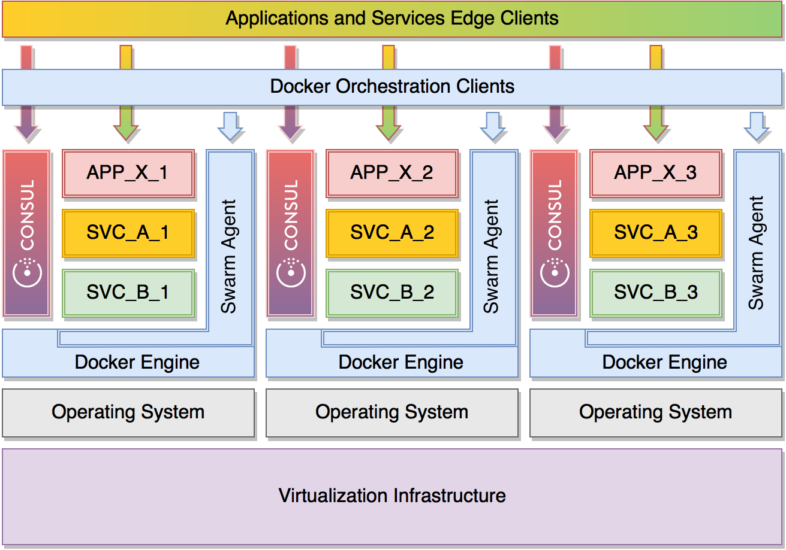

# [Toward a Production-Ready Docker Swarm Cluster with Consul] (https://medium.com/@dweomer/toward-a-production-ready-docker-swarm-cluster-with-consul-9ecd36533bb8)
> Wherein I explore the requirements of, and develop a repeatable process for, standing up a moderately opinionated, production-ready Docker cluster using the community standard Engine, Machine, Swarm and Compose. HashiCorp Consul will be used as the key-value store for Swarm as well as providing a common discovery mechanism across all nodes.

## Guiding Principles
* Highly available and fault-tolerant key-value store
* Highly available Swarm masters
* Overlay networking
* Repeatable, automation-ready setup
* All cluster and node services delivered as containers
* Smarter-than-default logging
* Memory accounting configured in kernel

## Getting Started
Initially this project is setup to support only Digital Ocean droplets running Ubuntu 15.10. It should be trivial to support other virtualization providers. See [drivers/digitalocean.env](drivers/digitalocean.env)

### Install Docker Engine, Compose, and Machine
See:
* [docker-engine v1.10.2](https://github.com/docker/docker/releases/tag/v1.10.2) downloads.
* [docker-compose v1.6.2](https://github.com/docker/compose/releases/tag/1.6.2) installation instructions.
* [docker-machine v0.6.0](https://github.com/docker/machine/releases/tag/v0.6.0) installation instructions.

### Digital Ocean API Access Token
Mosey on over to [Digital Ocean](https://cloud.digitalocean.com/settings/api/tokens) and setup an access token called `docker-swarm-consul` (or whatever floats your boat) and create a rcfile named `~/.digitalocean/docker-swarm-consul` with content that looks something like this:
```
export DIGITALOCEAN_ACCESS_TOKEN="my-super-cool-access-token-hash"
```
This will be picked up automatically by [drivers/digitalocean.env](drivers/digitalocean.env) and sourced. If no such file exists you will want to otherwise setup an environment variable named `DIGITALOCEAN_ACCESS_TOKEN` before these humble scripts will work.

--


